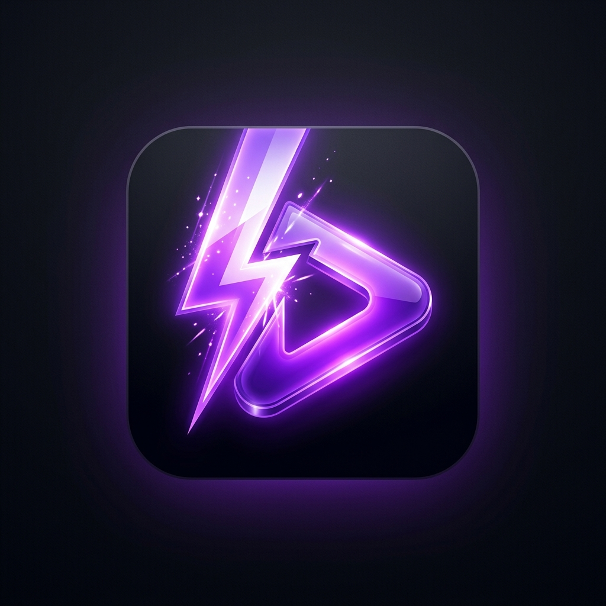

<div align="center">
  
</div>

<h1 align="center">ReelPilot</h1>

<p align="center">
  <strong>An automated, AI-powered 9:16 short-form video generator with a sleek Web UI.</strong><br>
  Generate TikTok, YouTube Shorts, and Instagram Reels instantly using LLMs, Deepgram Aura voiceovers, and Pexels b-roll.
</p>

## 🚀 Features

- **Sleek Web Dashboard:** A dark-themed, responsive web interface for managing your creations, local music library, and video generation.
- **AI Scripting:** Powered by OpenAI/Gemini models to generate high-retention scripts with dynamic pacing and hooks.
- **Cinematic Hooks:** Automatically fetches and integrates high-retention visual hooks (via Malloy hooks).
- **Pro Voiceovers:** Uses Deepgram Aura TTS for incredibly realistic, human-like narration.
- **Dynamic B-Roll & Fallbacks:** Uses Pexels Videos API to fetch highly relevant 9:16 vertical b-roll. Falls back to static images with beautiful *Ken Burns* motion effects when videos aren't available.
- **Hardware-Accelerated Rendering:** Lightning-fast FFmpeg pipeline utilizing NVIDIA (NVENC) or Intel (QSV) hardware acceleration.
- **Local Music Library:** Upload your own BGM or let the AI automatically pick from the Pixabay Music API.
- **Auto-Pilot Mode:** Provide absolutely no input, and the AI will brainstorm a topic, pick a hook, and generate a video completely autonomously.
- **Pop-On Captions:** Automatically generated, word-level timed ASS subtitles using `faster-whisper`.

## 📦 Installation

```powershell
# 1. Install ffmpeg (required for rendering)
scoop install ffmpeg   # or choco install ffmpeg

# 2. Clone the repo
git clone https://github.com/yourusername/reelpilot-studio.git
cd reelpilot-studio

# 3. Create a virtual environment and install dependencies
uv venv
uv pip install -e ".[dev]"

# 4. Set up environment variables
copy .env.example .env
```

## 🔑 Environment Setup

Edit your `.env` file and add your API keys:

- `OPENAI_API_KEY` — Script + rerank endpoint
- `GEMINI_API_KEY` — (Optional) Gemini API endpoint for native script writing
- `DEEPGRAM_API_KEY` — Aura TTS for voiceovers
- `PEXELS_API_KEY` — B-roll videos and images
- `PIXABAY_API_KEY` — Background music (Optional, you can upload your own to the Web UI)

## 🖥️ Usage

### Web UI (Recommended)

Start the interactive web dashboard:

```powershell
python -m reelpilot --web
```
Navigate to `http://localhost:8000` to access the sleek ReelPilot UI!

> [!WARNING]  
> **Security Note:** The Web UI includes a built-in Settings panel that allows you to view and edit your API keys. It is designed for **local use only**. If you plan to host this Web UI on a public-facing server, you **must** implement authentication (e.g., HTTP Basic Auth or a login system) or your API keys will be exposed to the internet.

### Command Line Interface

You can also use the powerful CLI for automation or batch generation:

```powershell
# Auto-Pilot Mode (Random topic & hook)
python -m reelpilot

# Batch Auto-Pilot Mode (Generate 5 random videos)
python -m reelpilot --count 5

# Specific Topic
python -m reelpilot "POV: you finally understood async Python" --hook auto --voice aura-orion-en

# Force specific background music
python -m reelpilot "The best productivity hack" --bgm lofi-chill.mp3
```

## 📂 Project Structure

- `src/reelpilot/web.py` — FastAPI web server and UI routes
- `src/reelpilot/cli.py` — Typer CLI entrypoint and pipeline orchestrator
- `src/reelpilot/assembly.py` — Hardware-accelerated FFmpeg pipeline
- `src/reelpilot/broll.py` — Pexels video & image fallback engine
- `src/reelpilot/effects.py` — Ken Burns effects, color grading, scaling
- `src/reelpilot/script.py` — LLM prompting and beat structuring

## 📄 License

MIT License.

*Note: Malloy hooks downloaded into `assets/hooks` are free to use commercially per their respective licensing. An attribution sidecar (`<slug>.txt`) is automatically written next to every output MP4 with full Pexels/Pixabay credits.*